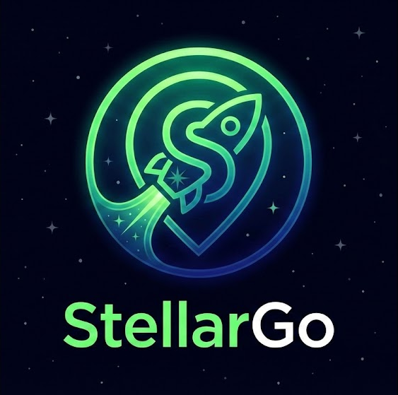

# StellarGo - Location-Based SocialFi Platform

<div align="center">



**Drop crypto anywhere on Earth. Powered by Stellar Network.**

[](https://opensource.org/licenses/MIT)
[](https://nextjs.org/)
[](https://stellar.org/)

[Demo](https://stellargo.vercel.app) · [Documentation](./docs) · [Report Bug](https://github.com/MYounesDev/stellargo/issues) · [Request Feature](https://github.com/MYounesDev/stellargo/issues)

</div>

---

## 🌟 Overview

**StellarGo** is the first location-based SocialFi platform built on the Stellar Network. Create "Geo-Drops" - cryptocurrency amounts placed at physical locations that anyone nearby can discover and claim. Think of it as a global treasure hunt combined with instant crypto payments.

### ✨ Key Features

- 🗺️ **Location-Based Drops**: Place crypto at GPS coordinates for others to find
- ⚡ **Lightning Fast**: Transactions confirm in 3-5 seconds on Stellar
- 💰 **Ultra Low Cost**: Transaction fees under $0.01
- 🎯 **Targeted Drops**: Public, friends-only, or customer-specific
- 🏆 **Gamification**: Levels, badges, and leaderboards
- 📱 **Mobile First**: Responsive design with bottom navigation
- 🌙 **Dark Mode**: Futuristic fintech aesthetic

---

## 🎯 Target Audiences

### 👥 Personal Users
Share crypto with friends, create treasure hunts, or discover drops near you

### 💼 Businesses
Reward loyal customers, drive foot traffic, and create engaging marketing campaigns

### ❤️ Non-Profits
Distribute aid directly, create fundraising events, and engage your community

---

## 🚀 Quick Start

### Prerequisites

- Node.js 18+
- MongoDB (local or Atlas)
- Freighter Wallet Extension

### Installation

```bash
# Clone repository
git clone https://github.com/MYounesDev/stellargo.git
cd stellargo

# Install dependencies
npm install

# Configure environment
cp .env.example .env.local
# Edit .env.local with your MongoDB URI

# Seed database
npm run seed

# Start development server
npm run dev
```

Visit [http://localhost:3000](http://localhost:3000) 🎉

**Detailed guides:**
- [📖 Installation Guide](./INSTALL.md)
- [🏃 Running Guide](./RUN.md)
- [🚢 Deployment Guide](./DEPLOY.md)

---

## 🏗️ Tech Stack

### Frontend
- **Next.js 14** - React framework with App Router
- **TypeScript** - Type safety
- **Tailwind CSS** - Utility-first styling
- **Framer Motion** - Animations
- **Leaflet** - Interactive maps
- **Lucide React** - Icon library

### Backend
- **Next.js API Routes** - Serverless functions
- **MongoDB + Mongoose** - Database
- **Stellar SDK** - Blockchain integration

### Web3
- **Freighter API** - Stellar wallet integration
- **Stellar Network** - Fast, low-cost transactions

---

## 📱 Features Deep Dive

### Geo-Drop System

Create drops with:
- Custom amounts (0.1+ XLM)
- Personal messages
- Target audience (public/friends/customers)
- Expiration times
- 50m claim radius

### User Profiles

- **Personas**: Personal, Business, or Non-Profit
- **Levels**: Earn XP by creating and claiming drops
- **Badges**: Unlock achievements
- **Statistics**: Track your activity

### Advanced Features

- **Direct Transfers**: Send XLM to any Stellar address
- **Transaction History**: View all drops created and claimed
- **Leaderboard**: See top contributors
- **Interactive Map**: Real-time drop visualization

---

## 🗂️ Project Structure

```
stellargo/
├── src/
│   ├── app/                  # Next.js 14 App Router
│   │   ├── api/              # API routes
│   │   ├── app/              # Protected app pages
│   │   ├── faq/              # FAQ page
│   │   └── page.tsx          # Landing page
│   ├── components/           # React components
│   │   ├── Button.tsx
│   │   ├── Card.tsx
│   │   ├── ConnectWallet.tsx
│   │   ├── Modal.tsx
│   │   ├── Navbar.tsx
│   │   └── OnboardingModal.tsx
│   ├── hooks/                # Custom React hooks
│   │   └── useWallet.ts
│   ├── lib/                  # Utilities
│   │   ├── freighter.ts      # Wallet integration
│   │   ├── mongodb.ts        # Database connection
│   │   └── stellar.ts        # Stellar SDK wrapper
│   ├── models/               # MongoDB models
│   │   ├── Drop.ts
│   │   └── User.ts
│   └── types/                # TypeScript types
│       └── index.ts
├── scripts/                  # Utility scripts
│   └── seed.js               # Database seeding
├── public/                   # Static assets
├── INSTALL.md               # Installation guide
├── RUN.md                   # Running guide
├── DEPLOY.md                # Deployment guide
└── README.md                # This file
```

---

## 🔧 Configuration

### Environment Variables

```env
# Database
MONGODB_URI=mongodb://localhost:27017/stellargo

# Stellar Network
STELLAR_NETWORK=testnet  # or 'public' for mainnet

# App URL (optional)
NEXT_PUBLIC_APP_URL=http://localhost:3000
```

### Stellar Networks

- **Testnet**: Free test XLM, for development
- **Public**: Real XLM, for production

Get testnet XLM: [Stellar Laboratory](https://laboratory.stellar.org/#account-creator?network=test)

---

## 📊 Database Schema

### User Model

```typescript
{
  publicKey: string;        // Stellar address
  username?: string;
  bio?: string;
  persona: 'personal' | 'business' | 'nonprofit';
  level: number;
  badge?: string;
  totalDropsCreated: number;
  totalDropsClaimed: number;
  totalAmountSent: number;
  totalAmountReceived: number;
}
```

### Drop Model

```typescript
{
  location: {
    type: 'Point';
    coordinates: [number, number];  // [lng, lat]
  };
  amount: number;
  message: string;
  createdBy: string;
  claimed: boolean;
  claimedBy?: string;
  claimedAt?: Date;
  targetAudience: 'public' | 'friends' | 'customers';
  expiresAt?: Date;
}
```

---

## 🎨 Design System

### Colors

- **Cyber Green**: `#00ff9d` - Primary CTA
- **Dark Background**: `#0a0a0a`
- **Charcoal Cards**: `rgba(10, 10, 10, 0.6)` with blur

### Components

- **Glassmorphism**: Backdrop blur with transparency
- **Rounded Corners**: `xl` to `2xl`
- **Animations**: Smooth transitions, hover effects
- **Icons**: Lucide React (no emojis in UI)

### Responsive Design

- **Desktop**: Fixed top navigation
- **Mobile**: Bottom navigation bar (app-like)

---

## 🧪 Testing

```bash
# Run linter
npm run lint

# Type check
npx tsc --noEmit

# Test build
npm run build

# Test database connection
npm run seed
```

---

## 🤝 Contributing

We welcome contributions! Please see [CONTRIBUTING.md](./CONTRIBUTING.md) for guidelines.

1. Fork the repository
2. Create a feature branch (`git checkout -b feature/amazing-feature`)
3. Commit your changes (`git commit -m 'Add amazing feature'`)
4. Push to the branch (`git push origin feature/amazing-feature`)
5. Open a Pull Request

---

## 📜 License

This project is licensed under the MIT License - see [LICENSE](./LICENSE) file for details.

---

## 🙏 Acknowledgments

- **Stellar Development Foundation** - For the amazing blockchain network
- **Freighter Team** - For the wallet extension
- **Next.js Team** - For the fantastic framework
- **Community Contributors** - Thank you all!

---

## 📞 Support

- **Documentation**: Check in-app FAQ page
- **Issues**: [GitHub Issues](https://github.com/MYounesDev/stellargo/issues)
- **GitHub**: [MYounesDev](https://github.com/MYounesDev)
- **LinkedIn**: [Myounesdev](https://www.linkedin.com/in/Myounesdev)

---

## 🗺️ Roadmap

### Phase 1 (Current)
- [x] Core geo-drop functionality
- [x] Wallet integration
- [x] User profiles and personas
- [x] Map interface
- [x] Transaction history

### Phase 2 (Next)
- [ ] Friends system
- [ ] Drop comments
- [ ] Push notifications
- [ ] Mobile app (React Native)
- [ ] Advanced analytics

### Phase 3 (Future)
- [ ] NFT drops
- [ ] Soroban smart contracts
- [ ] DAO governance
- [ ] Multi-chain support

---

## 📈 Stats

- **Transactions**: 3-5 second confirmation
- **Fees**: < $0.01 per transaction
- **Scalability**: 1000+ TPS on Stellar
- **Uptime**: 99.9% (Stellar Network)

---

<div align="center">

**Built with ❤️ for the Stellar community**

[GitHub](https://github.com/MYounesDev) · [LinkedIn](https://www.linkedin.com/in/Myounesdev)

⭐ Star us on GitHub!

</div>
